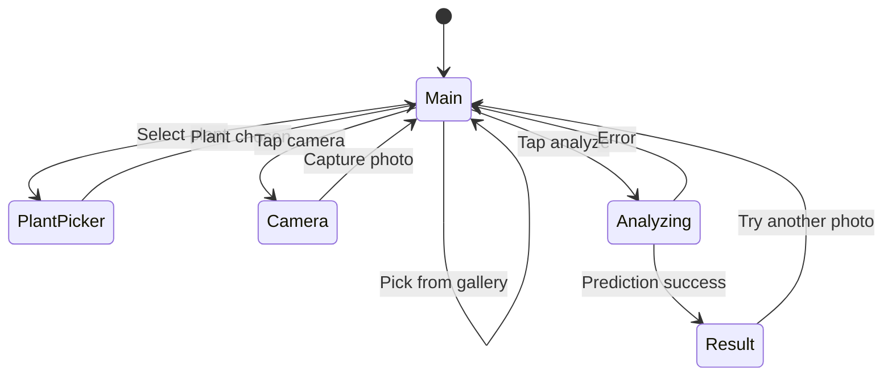

# CropDoctor

CropDoctor is an Expo + React Native app that identifies plant diseases from a leaf image.

The app flow is:

1. User selects a plant.
2. User captures or picks a leaf image.
3. App validates that the leaf likely matches the selected plant.
4. App runs disease classification and returns the top prediction with confidence.

## Tech Stack

- Expo SDK 54
- React Native 0.81
- Expo Router
- TensorFlow Lite inference via `react-native-fast-tflite`
- Image preprocessing with `expo-image-manipulator`, `expo-file-system`, and `pako`

## Project Structure

- `app/index.tsx`: Main UI flow (plant picker, camera/gallery, analyze button, results).
- `util/predict.ts`: Model loading, image-to-tensor conversion, plant validation, and disease prediction.
- `util/labels.json`: Disease model labels (format like `Plant___Disease_Name`).
- `util/labels_m2.json`: Plant label mapping for leaf validation model.
- `util/plant_model.tflite`: TFLite model used by current inference code.

## High-Level Architecture

```mermaid
flowchart LR
   UI[app/index.tsx\nUser Interaction] --> PRED[predictDisease(...)\nutil/predict.ts]
   PRED --> PREP[imageToTensor\n224x224 RGB Float32]
   PREP --> LV[validateSelectedLeaf\nplant mismatch guard]
   LV --> INF[runModel\nTFLite inference]
   INF --> POST[Label filtering + top score]
   POST --> UI
```

## Inference Pipeline

```mermaid
flowchart TD
   A[Input image URI] --> B[Load TFLite model]
   B --> C[Resize image to 224x224 PNG]
   C --> D[Read base64 bytes]
   D --> E[Parse PNG chunks + inflate IDAT]
   E --> F[Unfilter scanlines\n(PNG filter types 0..4)]
   F --> G[Build Float32 tensor\nnormalized RGB in 0..1]
   G --> H[Optional leaf validation\nusing mobilenet labels]
   H --> I[Run disease model]
   I --> J[Convert logits to probabilities\nif needed]
   J --> K[Filter labels by selected plant]
   K --> L[Pick max confidence result]
   L --> M[Return disease, confidence, isHealthy]
```

## App Screen Flow



## Setup

1. Install dependencies.

```bash
npm install
```

2. Build and run a development build (required for native TFLite module).

```bash
npm run android
```

or

```bash
npm run ios
```

3. Start Metro.

```bash
npm start
```

## Why Development Build (Not Expo Go)

This app uses `react-native-fast-tflite` (a native JSI module). Expo Go does not include arbitrary native modules, so inference requires a custom development build created with `expo run:android` or `expo run:ios`.

## Available Scripts

- `npm start`: Start Metro bundler.
- `npm run android`: Build/run Android development build.
- `npm run ios`: Build/run iOS development build.
- `npm run web`: Start web build (UI testing only).
- `npm run lint`: Run Expo lint.

## Prediction Contract

`predictDisease(imageUri, modelType, options)` returns:

```ts
{
  disease: string;
  confidence: number; // percentage, e.g. 93.4
  isHealthy: boolean;
  modelUsed: string;
}
```

## Notes and Limitations

- Disease labels are plant-scoped using the `Plant___Disease` naming convention.
- If plant validation strongly disagrees with the selected plant, inference is blocked with an error.
- If plant validation is uncertain, inference continues.
- Current model file loaded by code is `util/plant_model.tflite`.

## Troubleshooting

- Error: `react-native-fast-tflite is not available`
  - Build a native dev client with `npm run android` or `npm run ios`.
- Error: camera/gallery permission denied
  - Enable permissions in device settings and relaunch the app.
- Error: selected plant does not match photo
  - Choose the matching plant type or take a clearer leaf photo.

## Future Improvements

- Separate plant-validation and disease models explicitly in code and assets.
- Add top-k predictions and per-class probability breakdown.
- Add offline result history for repeated diagnostics.
