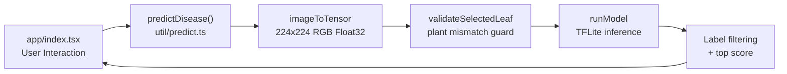
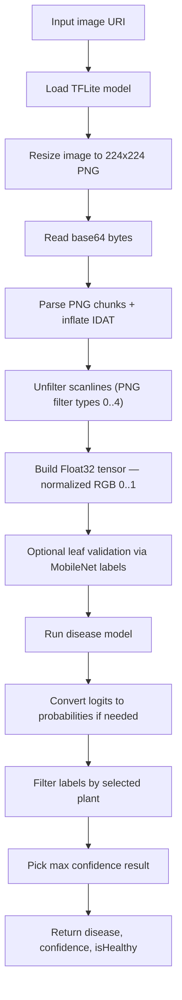
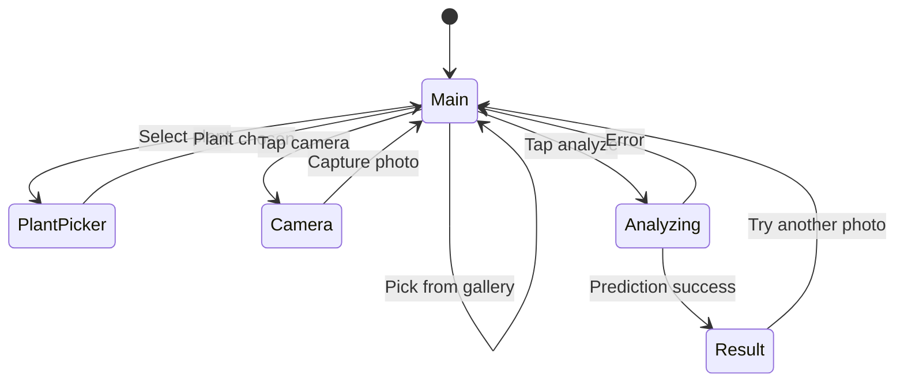

# 🌿 CropDoctor

CropDoctor is an **Expo + React Native** app that identifies plant diseases from a leaf image using on-device TensorFlow Lite inference.

---

## How It Works

1. User selects a plant type.
2. User captures or picks a leaf image from the gallery.
3. App validates that the leaf likely matches the selected plant.
4. App runs disease classification and returns the top prediction with confidence score.

---

## Tech Stack

| Layer | Technology |
|---|---|
| Framework | Expo SDK 54 / React Native 0.81 |
| Navigation | Expo Router |
| Inference | `react-native-fast-tflite` (TFLite JSI module) |
| Image Preprocessing | `expo-image-manipulator`, `expo-file-system`, `pako` |

---

## Project Structure

```
.
├── app/
│   └── index.tsx          # Main UI: plant picker, camera/gallery, results
├── util/
│   ├── predict.ts          # Model loading, image-to-tensor, validation, prediction
│   ├── labels.json         # Disease model labels (Plant___Disease_Name format)
│   ├── labels_m2.json      # Plant label mapping for leaf validation model
│   └── plant_model.tflite  # TFLite model used by current inference code
```

---

## Architecture

### High-Level Flow



### Inference Pipeline



### App Screen Flow



---

## Prediction Contract

`predictDisease(imageUri, modelType, options)` returns:

```ts
{
  disease: string;
  confidence: number;  // percentage, e.g. 93.4
  isHealthy: boolean;
  modelUsed: string;
}
```

---

## Setup

### 1. Install dependencies

```bash
npm install
```

### 2. Build a development client

> **Required** — this app uses `react-native-fast-tflite`, a native JSI module not included in Expo Go.

```bash
# Android
npm run android

# iOS
npm run ios
```

### 3. Start Metro

```bash
npm start
```

---

## Available Scripts

| Script | Description |
|---|---|
| `npm start` | Start Metro bundler |
| `npm run android` | Build and run Android dev build |
| `npm run ios` | Build and run iOS dev build |
| `npm run web` | Start web build (UI testing only) |
| `npm run lint` | Run Expo lint |

---

## Notes & Limitations

- Disease labels follow the `Plant___Disease` naming convention.
- If plant validation **strongly** disagrees with the selected plant, inference is blocked with an error.
- If plant validation is **uncertain**, inference continues with a warning.
- The active model file is `util/plant_model.tflite`.

---

## Troubleshooting

**`react-native-fast-tflite is not available`**
→ Run `npm run android` or `npm run ios` to build a native dev client. Expo Go will not work.

**Camera / gallery permission denied**
→ Enable permissions in your device settings and relaunch the app.

**"Selected plant does not match photo"**
→ Choose the correct plant type from the picker, or retake a clearer leaf photo.

---

## Future Improvements

- [ ] Separate plant-validation and disease models explicitly in code and assets.
- [ ] Add top-k predictions with per-class probability breakdown.
- [ ] Add offline result history for repeated diagnostics.

---

## References

- [PlantVillage Disease Classification (arXiv:2104.00298)](https://arxiv.org/pdf/2104.00298)
